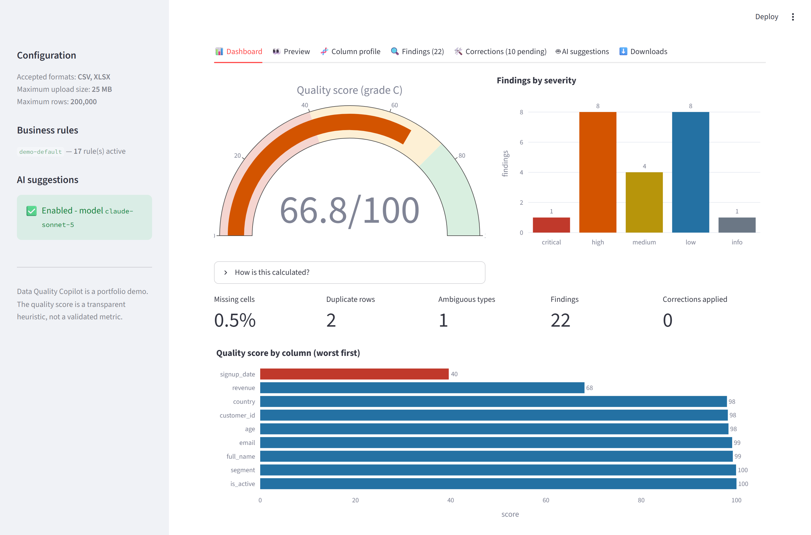
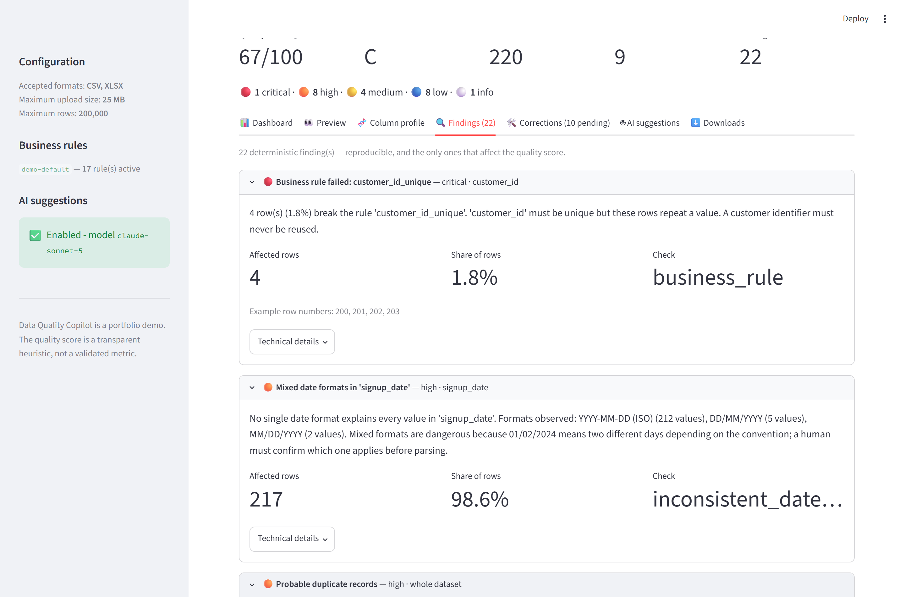
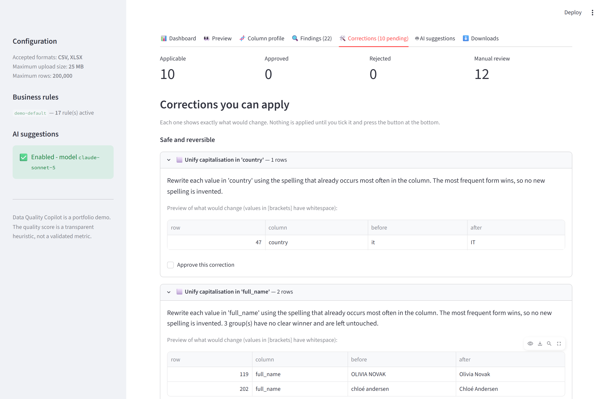
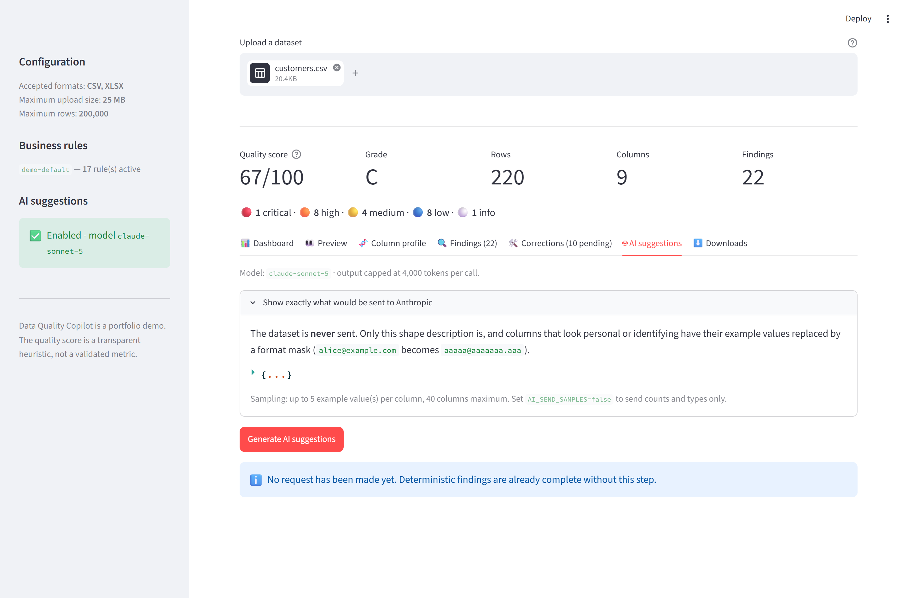
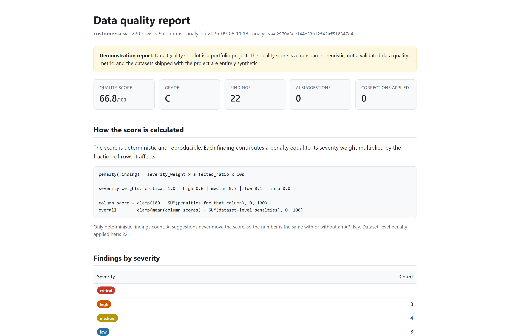
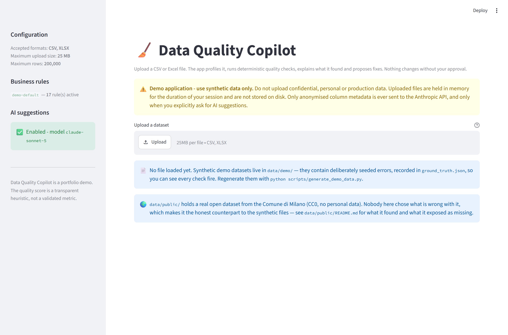
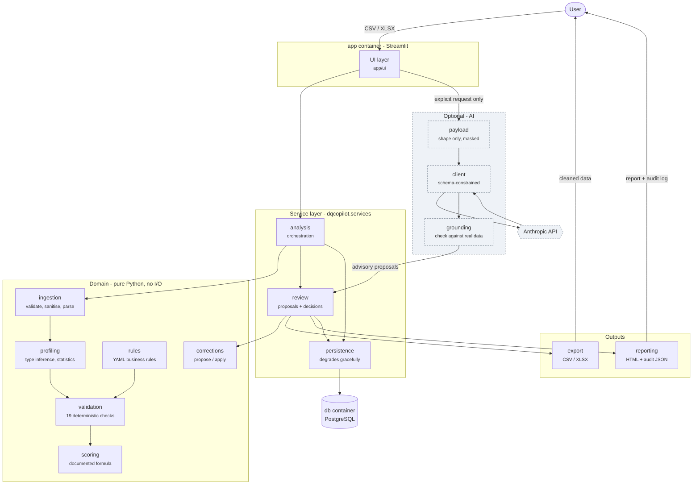

# Data Quality Copilot

Upload a CSV or Excel file. The application profiles it, runs deterministic quality
checks, explains what it found in plain language, and proposes corrections — **and
changes nothing until you approve each one**. It then produces a cleaned dataset, a
quality report, and an audit log of every decision you took.

> **Portfolio demonstration project.** It is not production software, it has no
> authentication, and the quality score is a transparent heuristic defined here rather
> than a validated metric. The datasets shipped with it are entirely synthetic. Please
> do not upload confidential or personal data.

---

## The problem it addresses

Most "data quality" work in a small analytics team is the same afternoon repeated: a
file arrives, someone opens it in Excel, notices that `country` contains both `FR` and
`France`, that revenue is stored as `"1,234.56"` so it will not sum, that a few
customers have no email, and that two rows are the same supplier typed twice. They fix
some of it by hand, keep no record of what they changed, and the next file arrives with
the same problems.

Two things usually go wrong with the tools meant to help:

1. **They automate the judgement away.** A tool that silently merges `UK` into
   `United Kingdom` is fine until the day those are genuinely different rows, and by
   then nobody can tell what it did.
2. **They leave no trail.** When a number in a report looks wrong three weeks later,
   "what did we change, and who decided that?" has no answer.

This project takes the opposite position on both. Every finding is explained, every
correction is proposed rather than applied, and every decision — including the ones you
*reject* — is recorded.

### Who it is for

- **Data analysts and engineers** receiving recurring files from outside their control.
- **Operations teams** maintaining customer, supplier or product master data.
- **Anyone preparing a dataset for a warehouse load** who needs to know what will break
  before it breaks.

---

## What it does

| Stage | What happens |
|---|---|
| **1. Upload** | CSV or XLSX, validated by extension *and* by content signature. |
| **2. Preview** | The dataset as it was actually read, before anything is inferred. |
| **3. Profile** | Per-column type inference, missing counts, cardinality, distributions. |
| **4. Detect** | 19 deterministic checks plus your configurable business rules. |
| **5. Explain** | Each finding says what it is, how many rows, and why it matters. |
| **6. Propose** | Concrete corrections with a before/after preview. Nothing is applied. |
| **7. Approve** | You tick what you want. Destructive and AI-sourced fixes are separated. |
| **8. Apply** | Approved corrections only, in a fixed, documented order. |
| **9. Export** | Cleaned CSV/XLSX, a self-contained HTML report, a JSON audit log. |
| **10. Record** | Analysis, findings, decisions and applied changes stored in PostgreSQL. |

---

## Screenshots

Regenerate all six from the running app with `python scripts/capture_screenshots.py`, so
they cannot quietly drift out of date as the interface changes.

**The dashboard** — score gauge, findings by severity, and a per-column score that says
which column is dragging the number down.



**Findings**, worst first, each one explaining itself in a sentence a non-engineer can
act on rather than a rule id.



**Corrections**, split into safe and destructive, each showing exactly which rows would
change from what to what. Nothing is applied until a box is ticked.



**The AI panel** before any request is made. The expander shows the entire payload that
would leave the machine: a shape description, never the dataset, with personal-looking
columns reduced to a format mask.



**The exported report**, which states its own limits and shows the score formula rather
than asking to be trusted.



<details>
<summary>The upload screen</summary>



</details>

---

## Quick start

### With Docker (recommended)

```bash
git clone <your-fork-url> Data-Quality-Copilot
cd Data-Quality-Copilot
cp .env.example .env
docker compose up --build
```

Then open <http://localhost:8501>.

This starts two containers: `app` (Streamlit + the Python services) and `db`
(PostgreSQL 16). On start-up the app waits for the database, applies the Alembic
migrations, and generates the synthetic demo datasets.

### Without Docker

```bash
python -m venv .venv
source .venv/bin/activate        # Windows: .venv\Scripts\activate
pip install -e ".[dev]"
cp .env.example .env
python scripts/generate_demo_data.py
streamlit run app/streamlit_app.py
```

Python 3.12+. No database server needed: the default `DATABASE_URL` is a local SQLite
file and the tables are created on first run.

### Try it

Upload `data/demo/customers.csv`. It contains deliberately seeded errors, every one of
them recorded in `data/demo/ground_truth.json`.

---

## Environment variables

Copy `.env.example` to `.env`. `.env` is git-ignored; **no key or password is ever
committed.**

| Variable | Default | Purpose |
|---|---|---|
| `DATABASE_URL` | `sqlite+pysqlite:///./dqcopilot.db` | SQLAlchemy URL. Compose overrides it with PostgreSQL. |
| `PERSISTENCE_ENABLED` | `true` | Set `false` to run with no database at all. |
| `PERSIST_EXAMPLES` | `false` | When `false`, example cell values are stripped before anything is stored. |
| `MAX_UPLOAD_MB` | `25` | Upload size limit, enforced server-side. |
| `MAX_ROWS` / `MAX_COLUMNS` | `200000` / `500` | Dataset size limits. |
| `RULES_FILE` | `config/business_rules.yaml` | Business rule definitions. |
| `ANTHROPIC_API_KEY` | *(empty)* | Optional. Empty means reduced mode. |
| `ANTHROPIC_MODEL` | `claude-opus-5` | Set to `claude-sonnet-5` for a cheaper run. |
| `AI_MAX_OUTPUT_TOKENS` | `4000` | Hard ceiling per AI call. |
| `AI_SAMPLE_ROWS` | `5` | Example values per column sent to the model. |
| `AI_SEND_SAMPLES` | `true` | Set `false` to send only counts and types — no values at all. |
| `LOG_LEVEL` / `LOG_JSON` | `INFO` / `false` | Logging level and format. |

**Reduced mode.** With no `ANTHROPIC_API_KEY`, every deterministic check, correction,
export and audit record still works. Only the AI suggestion panel is switched off, and
the app says so plainly rather than failing.

---

## Architecture



The dependency rule: **the domain layer imports nothing from the service or UI layers.**
Ingestion, profiling, validation, corrections and scoring are pure functions over a
DataFrame, which is why the whole flow is testable without a browser or a database.

See [`docs/architecture.md`](docs/architecture.md) for the module-by-module walkthrough
and the reasoning behind the main design decisions.

### Repository layout

```
├── app/                     Streamlit UI (thin: collects input, renders results)
│   ├── streamlit_app.py
│   └── ui/                  dashboard, corrections, AI panel, downloads, state
├── src/dqcopilot/
│   ├── config.py            Settings from environment variables
│   ├── naming.py            Column-name heuristics (whole-word matching)
│   ├── scoring.py           The quality score formula
│   ├── models/              Pydantic domain models
│   ├── ingestion/           Validation, sanitisation, CSV/XLSX parsing
│   ├── profiling/           Type inference and per-column statistics
│   ├── validation/checks/   The deterministic checks
│   ├── rules/               Configurable business rules
│   ├── corrections/         Proposal and application
│   ├── ai/                  Payload, client, schemas, grounding, suggester
│   ├── db/                  SQLAlchemy models, sessions, repository
│   ├── export/              Cleaned dataset export
│   ├── reporting/           HTML report, audit log, Plotly figures
│   ├── services/            Orchestration used by the UI and the tests
│   └── demodata/            Synthetic data generator + ground truth
├── alembic/                 Database migrations
├── config/business_rules.yaml
├── data/demo/               Generated datasets and ground_truth.json
├── docs/                    Architecture, demo script, business one-pager
├── tests/                   ~380 tests
└── docker-compose.yml
```

---

## The checks

### Deterministic (Python, reproducible, no API key needed)

| Check | What it finds |
|---|---|
| `missing_values` | Nulls and whitespace-only cells, with severity scaled to the share. |
| `placeholder_values` | Filler standing in for data that was never collected (`N/A`, or a repeated word in a column of otherwise distinct names). |
| `constant_column` | Columns holding a single repeated value. |
| `exact_duplicate_rows` | Rows identical after trimming and case-folding. |
| `probable_duplicate_rows` | Same entity typed differently (`Acme Ltd` / `ACME Limited.`). |
| `invalid_date` | Values no known date format parses (`2023-02-30`). |
| `inconsistent_date_format` | Columns where no single format explains every value. |
| `future_date` | Future dates in columns recording past events. |
| `invalid_email` | Malformed addresses. |
| `numeric_stored_as_text` | Numbers carrying currency symbols, separators, percent signs. |
| `impossible_numeric` | Negative amounts, ages outside 0–120. |
| `suspicious_numeric` | Values beyond 5σ — flagged for review, never corrected. |
| `inconsistent_category` | Values differing only by punctuation or spacing. |
| `inconsistent_capitalization` | The same value written with different casing. |
| `leading_trailing_whitespace` | Padded values that break joins and grouping. |
| `corrupted_encoding` | UTF-8 text decoded as cp1252 or latin-1 (`Specialità`). |
| `mixed_datatypes` | Columns mixing numbers, dates and text substantially. |
| `schema_mismatch` | Header rows that were empty, duplicated or padded. |
| `business_rule` | Your configurable rules (below). |

Two design decisions worth calling out:

- **`numeric_stored_as_text` does not fire on clean numeric strings.** Every column of a
  CSV is technically text, so "this is a string" would fire on every numeric column of
  every CSV and mean nothing. It fires when values carry formatting a plain `float()`
  would reject.
- **`inconsistent_category` will not merge genuinely different spellings.** `UK` and
  `United Kingdom` are left to the AI panel or to a business rule, because collapsing
  them is a judgement, not a rule.

### Configurable business rules

Declared in [`config/business_rules.yaml`](config/business_rules.yaml) — no Python
change needed. Rules referencing columns a dataset does not have are *skipped*, not
failed, so one file serves every dataset.

```yaml
- name: revenue_not_negative
  type: range
  column: revenue
  minimum: 0
  severity: high
  description: Revenue is recorded gross; refunds belong in their own column.

- name: country_is_known
  type: allowed_values
  column: country
  values: [FR, DE, IT, ES, BE, NL, PT, UK, IE, PL, SE, US, CA]

- name: delivery_after_order
  type: comparison
  left: delivery_date
  operator: ">="
  right: order_date
  compare_as: date
```

Supported types: `not_null`, `range`, `allowed_values`, `no_future_dates`, `regex`,
`unique`, `comparison`.

### AI checks (optional)

The Anthropic API is used **only** for questions deterministic code cannot answer:

| Task | Question |
|---|---|
| Column interpretation | What does this ambiguously-named column hold? Is it personal data? |
| Category mapping | Do `France` and `FR` denote the same category here? |
| Anomaly explanation | What does this finding mean for someone using the data? |
| Rule suggestion | What business rules should this dataset have? |

Every AI response passes four gates before it reaches the screen:

1. **Schema-constrained generation** — `client.messages.parse(output_format=...)`.
2. **Pydantic validation**, with `extra="forbid"` so an unexpected payload is rejected
   rather than silently read as an empty result.
3. **Grounding** — a mapping is dropped unless *both* values actually occur in that
   column; a suggested rule is dropped unless its column exists and its bounds make
   sense. Rejections are shown to you with their reason.
4. **Human approval** — an AI suggestion becomes an ordinary proposal that you tick.

**AI findings never affect the quality score.** The number is identical with and without
an API key.

---

## The quality score

Deterministic, reproducible, and defined entirely here:

```
penalty(finding) = severity_weight × affected_ratio × 100

  critical 1.0 | high 0.6 | medium 0.3 | low 0.1 | info 0.0

column_score = clamp(100 − Σ penalties for that column, 0, 100)
overall      = clamp(mean(column_scores) − Σ dataset-level penalties, 0, 100)
```

Grades: A ≥ 90, B ≥ 75, C ≥ 60, D ≥ 40, E below.

Only deterministic findings contribute. The formula is printed in the app and in every
exported report, so the number is never a black box.

**It is not a validated data quality metric.** The weights were chosen by hand. It is
useful for comparing the *same* dataset before and after cleaning, and for ranking
columns within one dataset. It is not meaningful across organisations, and it should not
appear in a KPI.

---

## Security and privacy

| Decision | Why |
|---|---|
| Only `.csv` and `.xlsx` accepted | Everything else is rejected at the door. |
| Content signature checked against the extension | A renamed `.exe` or legacy `.xls` is rejected, not parsed. |
| Configurable size, row and column limits | Enforced server-side; the browser limit is only cosmetic. |
| Filenames sanitised | Path components and unsafe characters stripped before use. |
| Formulas never evaluated | Workbooks are read through openpyxl's cached-value mode. |
| Exports neutralise formula payloads | Cells starting with `=`, `+`, `-`, `@` are quoted, blocking CSV injection. |
| Uploads never written to disk | Held in memory for the session only. |
| The dataset is never sent to Anthropic | Only a shape description; see below. |
| Personal-looking columns are masked | `alice@example.com` → `aaaaa@aaaaaaa.aaa`. |
| Cell values stripped before storage | `PERSIST_EXAMPLES=false` by default. |
| Logs carry metadata only | Plus a redaction filter that scrubs keys and emails. |
| API key from the environment, held as `SecretStr` | Never logged, never rendered, never committed. |
| Container runs as a non-root user | Nothing in the app needs privileges. |

### What is actually sent to Anthropic

Nothing until you press the button on the AI tab, and the app shows you the exact
payload first. It contains column names, inferred types, counts, and up to
`AI_SAMPLE_ROWS` example values per column — with values masked for any column that
looks personal or identifying. Set `AI_SEND_SAMPLES=false` to send counts and types
only.

### The database stores metadata, not data

A stored analysis can tell you *that* five email addresses were malformed and *which
rows* they were in — not what they said. The report you download in your own session is
complete; the stored trail is deliberately not. `PERSIST_EXAMPLES=true` opts out.

---

## Testing

```bash
pytest                                    # everything
pytest --cov=dqcopilot --cov-report=term-missing
pytest tests/test_demo_data_detection.py  # detection against ground truth
pytest -m e2e                             # end-to-end service-layer flow
```

Roughly 475 tests. **No test makes a network call** — the Anthropic SDK is replaced by a
stub that can return malformed, hallucinated and adversarial responses on demand.

The test worth knowing about is `tests/test_demo_data_detection.py`. The demo generator
records every error it injects into `ground_truth.json`, and that test asserts each one
is found by an acceptable check. It is what stops the check suite degrading silently —
and it caught four real bugs while this project was being built, including a
near-duplicate blocking key that included the surrogate ID (guaranteeing that a
re-entered record could never match) and a substring match where `discount` triggered
the rule for `count`.

There is also a guard in the other direction: clean data must score ≥ 95, so a check
cannot buy recall with false positives.

---

## Scale: where this design stops being the right one

The honest answer to "does it handle large data?" is a measurement and a boundary, not a
claim. Reproduce both with:

```bash
python scripts/benchmark.py
```

Indicative run — 8 columns of deliberately messy synthetic data, profiling plus all 19
checks:

| rows | profile | checks | total | peak memory |
|---|---|---|---|---|
| 10,000 | 1.3 s | 1.8 s | ~6 s | 13 MB |
| 50,000 | 6.2 s | 14.6 s | ~24 s | 76 MB |
| 200,000 | 30.6 s | 56.1 s | ~89 s | 326 MB |

**Read the environment line the script prints before trusting any of this.** That run was
taken on a laptop with under 2 GB of free memory, and an earlier run of the same code on
the same machine was three times faster. The script warns when memory is low and prints
the spread across repeats, because a benchmark that hides its conditions is an anecdote
with a table around it.

What the shape says, and that part is stable: **time grows linearly with rows, memory
somewhat worse than linearly.** 200,000 rows is the configured ceiling
(`MAX_ROWS`), and it is a deliberate one rather than an accident.

### Why the ceiling is a product decision, not only a technical one

This is a tool for *interactive human review*. Nobody approves corrections row by row
across fifty million records. Past roughly a million rows the bottleneck stops being
pandas and becomes the reviewer, and the right architecture is a different one:

- **Push the checks into the warehouse.** Most of them are expressible as SQL —
  null counts, range violations, regex validity, duplicate keys. At scale you move the
  computation to the data instead of pulling the data into a Python process. That is what
  dbt tests and Great Expectations do, and it is the change that matters most.
- **Profile on a sample, validate on everything.** Type inference already samples;
  distributions do not need every row. Violations do.
- **Review aggregates and samples, never all rows.** The human sees "3.2% of `revenue`
  is negative, here are twelve examples", not three hundred thousand cells.

The pipeline is written as pure functions over a DataFrame precisely so that the engine
underneath can be swapped without touching the check logic. Doing that swap is real work,
not a configuration flag — it is listed under future improvements, not claimed as done.

## Limitations

Stated plainly, because a portfolio project that oversells itself is worse than one that
does less.

- **Single user, no authentication.** Anyone who can reach the port can use it.
- **In-memory processing.** Bounded by `MAX_ROWS` (200k by default). It is not a
  distributed pipeline and does not stream.
- **Session-scoped state.** Refreshing the browser loses the current review; the audit
  trail in PostgreSQL survives, the working session does not.
- **First worksheet only** for Excel files.
- **Ambiguous dates are read day-first.** `03/04/2024` is 3 April. The app flags mixed
  formats rather than guessing silently, but the parse itself picks a convention.
- **Near-duplicate detection is exact-match-on-a-normalised-key**, not fuzzy matching.
  It finds `Acme Ltd` / `ACME Limited.`; it will not find `Acme` / `Akme`.
- **Dependency detection compares column pairs**, so it is skipped above 60 columns and
  finds only single-column determinants. `postcode` decided by `city` is found; a value
  decided by two columns together is not.
- **The quality score is a heuristic**, as described above.
- **AI suggestions are not reproducible** between runs, which is exactly why they are
  excluded from the score.
- **Windows hosts need WSL2 enabled** before Docker Desktop will start
  (`wsl --install --no-distribution`, then reboot). Without it the engine stays stopped
  and `docker compose` cannot run.

---

## Future improvements

Roughly in the order they would pay off:

1. **Rule editing in the UI**, writing back to the YAML file with validation.
2. **Quality trend over time** — the schema already stores per-column scores per
   analysis, so this is a query and a chart, not new plumbing.
3. **Column-level lineage** for corrections, so a change can be traced to the finding
   and the reviewer that produced it.
4. **Streaming ingestion** (Polars or chunked pandas) to lift the row ceiling.
5. **Great Expectations export**, turning approved rules into a portable suite.
6. **Fuzzy duplicate matching** behind a confidence threshold, with the same
   grounding-and-approval discipline as the AI suggestions.
7. **Multi-sheet Excel support** with per-sheet analysis.
8. **Authentication and per-user audit attribution**, once there is more than one user.

---

## Documentation

- [`docs/architecture.md`](docs/architecture.md) — module walkthrough and design decisions
- [`docs/demo-script.md`](docs/demo-script.md) — 90-second demonstration script
- [`docs/business-one-pager.md`](docs/business-one-pager.md) — the non-technical summary
- [`CONTRIBUTING.md`](CONTRIBUTING.md) — setup, house rules, how to add a check

## Licence

MIT — see [`LICENSE`](LICENSE).

## Synthetic data disclaimer

Every dataset in `data/demo/` is generated by `src/dqcopilot/demodata/generator.py` from
a fixed seed. All names, companies, email addresses and identifiers are fabricated from
fixed word lists and resolve to nothing real. Any resemblance to a real person or
organisation is coincidental. Regenerate them at any time:

```bash
python scripts/generate_demo_data.py
```
