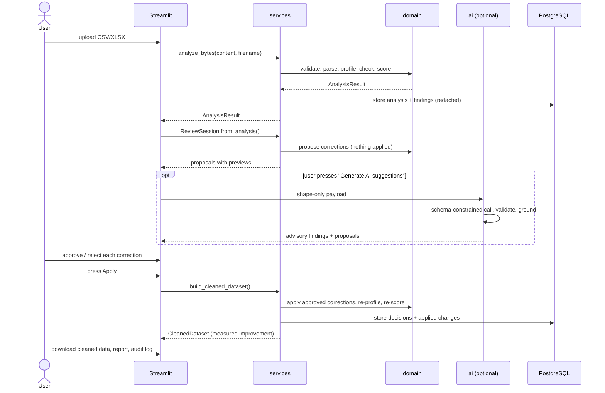

# Architecture

This document explains how the pieces fit together and, more usefully, *why* the
non-obvious decisions were made that way. The README covers what the application does;
this covers how it is built.

## The one rule

**The domain layer imports nothing from the service or UI layers.**

```
app/ui  ──▶  services  ──▶  domain (ingestion, profiling, validation, corrections, scoring)
                    │
                    └────▶  db, ai, export, reporting
```

Ingestion, profiling, validation, corrections and scoring are pure functions over a
pandas DataFrame. They do no I/O, hold no state, and know nothing about Streamlit or
SQLAlchemy. That is why the entire product flow — upload bytes in, cleaned bytes and a
report out — is exercised in tests without a browser or a database.

The service layer is where orchestration and side effects live. The UI is deliberately
thin: it collects an upload, calls a service, and renders the result.

## Layer by layer

### `ingestion` — the front door

Validates before it parses. Extension check, then a content-signature check (a ZIP magic
number for `.xlsx`, no NUL bytes for `.csv`), then a size check, then parsing, then a
shape check.

**Decision: CSV is read as raw strings (`dtype=str`); Excel keeps its native types.**

A data quality tool must see the original text. If pandas is allowed to infer types,
`"007"` becomes `7`, `"1,234.56"` becomes `NaN`, and the evidence for half the checks is
destroyed before the checks run. Excel is different: it already carries real type
information, and that information is itself useful evidence.

**Decision: delimiter detection considers only characters present in the header line.**

The first implementation used `csv.Sniffer`, which happily split a single-column file of
quoted values like `"1,234.50"` into two columns. Restricting candidates to the header
and then scoring each by how consistently it splits the first 25 rows fixed it. Headers
almost never contain the delimiter as data.

### `profiling` — what is in each column

`type_inference.py` holds the primitives the rest of the application shares: numeric
parsing, date-format matching, the missing-value definition. Sharing them is what
guarantees that "what the profiler saw" and "what the fix would do" cannot drift apart.

**Decision: date-format consistency is decided on the intersection of per-value format
sets, not on a single guess.**

`03/04/2024` legitimately matches both `DD/MM/YYYY` and `MM/DD/YYYY`. A column is
format-consistent when at least one format explains *every* value. That correctly treats
a column of ambiguous-but-uniform values as consistent, and flags a genuinely mixed
column — which a first-value guess would get backwards.

**Decision: type inference reads an evenly-spaced sample, not the first N rows.**

A stride keeps inference deterministic *and* robust to files sorted by one column. The
first 2000 rows of a file sorted by country tells you about one country.

**Decision: identifier detection is conservative.**

"Every value is distinct" is weak evidence in a small sample — eight unrelated words are
all distinct too. A column also needs a name that says identifier, or enough rows for
uniqueness to mean something, and columns that are mostly numbers or dates are never
identifiers. The first version classified an 8-row mixed column as an identifier and the
mixed-type check skipped it.

### `naming` — column-name heuristics

Small, but it earns its own module because it fixed a class of bug. Matching is on
**whole word tokens**, never substrings: `discount` contains `count`, and `average`
contains `age`. Both produced confident false positives before this existed.

### `validation` — the checks

Each check is a small class with a stable `check_id`, registered via a decorator. The
runner catches exceptions per check: one broken rule must never cost the user the other
sixteen.

**Decision: findings have stable, content-derived ids.**

`make_finding_id` hashes source, check, issue type, column and a discriminator. Re-run
the same analysis on the same file and the ids are identical, which is what lets a
user's approval decisions be matched across runs.

**Decision: a check that would have to guess reports the problem instead.**

`inconsistent_category` groups values that are identical once punctuation is removed. It
does not merge `UK` into `United Kingdom`. That is a judgement about the business, and
it belongs to a human, an `allowed_values` rule, or the AI panel — all three of which
make the decision visible.

### `rules` — configurable business rules

A discriminated Pydantic union over seven rule types, loaded from YAML. Rules whose
columns are absent are *skipped*, not failed, and the skips are reported once as a
single informational finding so nothing disappears silently. That is what lets one rule
file serve customers, sales and suppliers.

### `corrections` — propose, then apply

Split in two on purpose:

- `proposer.py` builds `CorrectionProposal` objects with a before/after preview. It
  never mutates anything.
- `applier.py` is **the only module in the project that changes a DataFrame**, and it
  only acts on proposals carrying an explicit `APPROVED` decision. It copies the frame;
  the original is never touched.

**Decision: a fixed application order, independent of approval order.**

Whitespace and case first, de-duplication last. Otherwise approving "trim whitespace"
and "remove duplicates" gives a different result depending on which checkbox you ticked
first — which is exactly the kind of surprise an audit trail is supposed to prevent.

**Decision: no correction resolves a tie.**

If two spellings are equally frequent, `_canonical_spelling_map` omits the group rather
than picking one. A coin flip presented as a fix is worse than no fix.

**Decision: imputation is offered, but labelled.**

Filling gaps with a median or mode is genuinely useful and genuinely dangerous. The
proposal says, in the text the user reads, that it invents data that was never collected
and will bias any statistic computed on the column.

### `ai` — optional, and untrusted

Four modules, deliberately separated by responsibility:

| Module | Responsibility |
|---|---|
| `payload.py` | Decides what leaves the machine. The privacy boundary. |
| `client.py` | Makes the call. Enforces the token ceiling and timeout, records usage. |
| `schemas.py` | Defines what a valid response looks like. |
| `grounding.py` | Decides whether a valid response is *true* for this dataset. |
| `suggester.py` | Turns what survives into ordinary findings and proposals. |

**Decision: schema validation and grounding are different jobs.**

Schema validation proves a response is well formed. It says nothing about whether the
column exists. `grounding.py` answers the second question: a category mapping is dropped
unless *both* values actually occur in that column, a suggested rule is dropped unless
its column exists and its bounds are coherent. Rejections carry a reason and are shown
to the user — the discarded suggestions are part of the story, not noise to hide.

**Decision: `extra="forbid"` on every AI schema.**

Without it, a response carrying entirely unexpected fields validates cleanly against a
model whose own fields all have defaults, and a wrong payload is silently read as an
empty result. A test asserts this.

**Decision: AI findings are excluded from the quality score.**

The score must be reproducible. Model output is not. Excluding it means the number is
identical with and without an API key — which also makes the score trustworthy as a
before/after measure.

**Decision: the network call is an explicit button.**

Not a side effect of uploading. The privacy promise is far easier to keep, and to
explain, when the user chooses the moment — and the app shows the exact payload first.

### `db` — the audit trail

Seven tables. `AuditEvent` is append-only: nothing in the application updates or deletes
one, which is what makes the trail worth having.

**Decision: the database stores metadata, not data.**

`redact_details` strips example values before persistence, replacing them with a count.
A stored analysis can say *that* five addresses were malformed and *which rows*, not
what they said. The report the user downloads in their own session is complete; the
stored trail is deliberately not. `PERSIST_EXAMPLES=true` opts out.

**Decision: persistence is optional and degrades.**

Analysis is the product; the audit trail is a record of it. If PostgreSQL is down the
user can still profile, review, clean and export — they just do not get a stored
history, and the UI says so. Every function in `services/persistence.py` returns an
outcome instead of raising.

**Decision: database errors are summarised before display.**

A raw SQLAlchemy message embeds the failing statement and its bound parameters. Those
belong in the log, not on screen. `short_reason` returns one line.

**Decision: `ensure_schema` creates tables on SQLite only.**

A first run that fails with "no such table" is a poor welcome. But silently creating
tables behind Alembic is how schema drift starts, so it does nothing for PostgreSQL,
where the migrations own the schema and CI checks the models have not drifted from them.

### `reporting` — the deliverables

The HTML report is a single self-contained file: no external CSS, no fonts, no scripts.
It renders offline, forever, and leaks nothing by fetching remote assets. Jinja
autoescaping is on, and a test asserts that a column named `<script>alert(1)</script>`
comes out escaped.

## Data flow, end to end



Note the re-profile step: the score after cleaning is **measured**, not predicted. The
cleaned dataset goes through the whole pipeline again from scratch.

## Deployment

Two containers, and no more:

- `app` — Streamlit plus the Python services, running as a non-root user, with a
  healthcheck on `/_stcore/health`.
- `db` — PostgreSQL 16, not published to the host by default.

The entrypoint waits for the database, applies migrations, generates the demo data, then
starts Streamlit. Migrations run there rather than at build time because the database
does not exist when the image is built.

Kubernetes, Redis, Celery and authentication were all considered and left out. For a
single-user demo none of them earns its complexity, and each would be another thing to
explain and to keep working. The point of the constraint is that the working thing is
finished.

## Testing strategy

| Layer | Approach |
|---|---|
| Type inference, checks, rules | Unit tests, including edge cases (empty, single row, all-null) |
| Ingestion | Malformed, oversized, disguised and corrupt files |
| Corrections | The approval guarantee: nothing applied without an explicit decision |
| AI | A stub SDK returning malformed, hallucinated and adversarial responses |
| Persistence | Temporary SQLite; plus a real connection to a dead port for degradation |
| Reporting | Context assertions, escaping, self-containment |
| End to end | `analyze_bytes` → review → apply → export, at the service layer |
| Detection quality | Every seeded defect in the ground truth must be found |

The last one is the load-bearing test. The generator records every error it injects;
`tests/test_demo_data_detection.py` asserts each is caught by an acceptable check, with
an explicit mapping of which checks legitimately explain which defect. A companion test
requires clean data to score ≥ 95, so recall cannot be bought with false positives.
